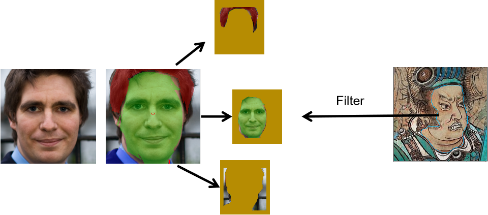

# LSMF: Local Segmentation and Multi-scale Fusion for Style Transfer

## Overview

This project implements a novel style transfer method based on segmentation and multi-scale feature fusion. The core modules include:

- **Style-SAM**: Style-Adaptive Segmentation
- **Mask Matching and Screening**: Aligning content and style regions
- **Regional Style Transfer**: Localized style transfer (AdaIN)
- **Multi-scale Feature Fusion**: Fusion of multi-scale features
- **Attention-guided Fusion**: Guiding the fusion process using attention mechanisms




## Requirements

- Python 3.8+
- PyTorch 1.13.0
- torchvision 0.14.0

## Installation

Install the required dependencies with:

```bash
pip install -r requirements.txt
